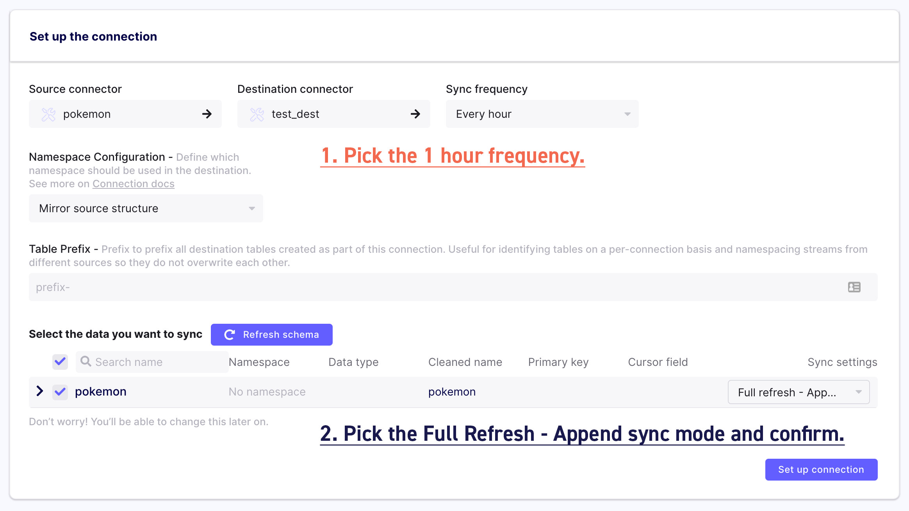
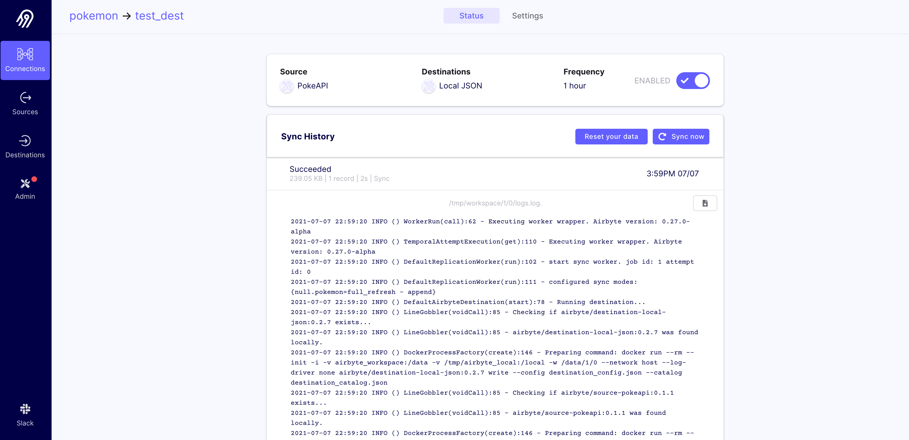

# Set up a Connection

---

When we create the connection, we can select which data stream we want to replicate. We can also select if we want an incremental replication, although it isn't currently offered for this source. The replication will run at the specified sync frequency.

To set it up, just follow the instructions on the screenshot below.



---

## Check the logs of your first sync

After you've completed the onboarding, you will be redirected to the source list and will see the source you just added. Click on it to find more information about it. You will now see all the destinations connected to that source. Click on it and you will see the sync history.

From there, you can look at the logs, download them, force a sync and adjust the configuration of your connection.



---

## Check the data of your first sync

Now let's verify that this worked:

```bash
cat /tmp/airbyte_local/json_data/_airbyte_raw_pokemon.jsonl
```

You should see a large JSON object with the response from the API, giving you a lot of information about the selected Pokemon.

If you have [`jq`](https://stedolan.github.io/jq/) installed, let's look at some of the data that we have replicated about `charizard`. We'll pull its abilities and weight:

```bash
cat _airbyte_raw_pokemon.jsonl | 
jq '._airbyte_data | {abilities: .abilities, weight: .weight}'
```

And there you have it. You've pulled data from an API directly into a file, with all of the actual configuration for this replication only taking place in the UI.

Note: If you are using Airbyte on Windows with WSL2 and Docker, refer to [this tutorial](../operator-guides/windows-locating-files-local-destination.md) or [this section](../connector-catalog/destinations/local-json.md#access-replicated-data-files) in the local-json destination guide to locate the replicated folder and file.

---

## That's it!

This is just the beginning of using Airbyte. We support a large collection of sources and destinations. You can even contribute your own.

If you have any questions at all, please reach out to us on [Slack](https://slack.airbyte.io/). We’re still in alpha, so if you see any rough edges or want to request a connector you need, please create an issue on our [Github](https://github.com/airbytehq/airbyte) or leave a thumbs up on an existing issue.

Thank you and we hope you enjoy using Airbyte.
